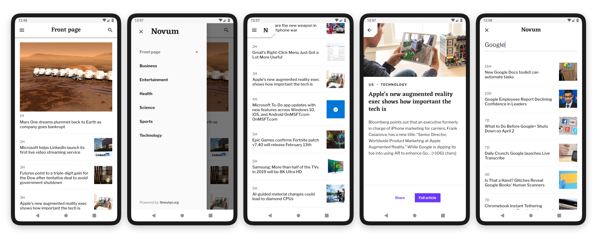

# Novum

Novum is a news app built with flutter and inspired by [Fortnightly](https://material.io/design/material-studies/fortnightly.html).

Novum is powered by [newsapi.org](https://newsapi.org) for news articles and [iextrading.com](https://iextrading.com/developer) for stock data.